# Insight into The boltdb

boltdb is widely used as key/value database in go community because it provided
stable and simple API for developer. And it is a relatively small code base so
that it is good point to learn how key/value databases works.

> NOTE: The code is based on [72c1660c13cb8cf0d590d91fb03625a68e53900f](https://github.com/etcd-io/bbolt/tree/72c1660c13cb8cf0d590d91fb03625a68e53900f)

## B+ Tree in boltdb

boltdb is using B+ Tree to store sorted data.

A B+ Tree is an N-ary tree consisting of root, internal nodes and leaves. The
root may be either a leaf or a node with two or more children. And internal
nodes doesn't contain any data and all the data are stored in leaves. Internal
nodes just store the key for search/index purposes.

Unlike B Tree, B+ Tree supports range search because all data items are sorted
and stored at the leaves. Both internal and leaf node are arranged in the
page(s), which be friendly for disk access.

### Property of B+ Tree

The almost common definition for branching factor of internal node is based on
the number of children. The branching factor of internal node
is **b** and the actual number of children for a node is **m**, which should be
limited between ceil(b/2) and b. For instance, the branching factor is 7 and
the each internal node should have between 4 and 7 children. The root node is
exception and it can have between 2 and 7 children. And there is other concept
for the B+ Tree, key number, for leaf node because they don't have any children.

One key/value might take more space but some just takes few bytes. Obviously,
it is not better to use key/value number as constrain only.

In order to contain more key/value in page(s), boltdb not just only uses
**minKey** to limit the key number for internal/leaf node, but also use
**fillPercent** to measures that node should be merged with other for rebalance
or splited caused by spill.

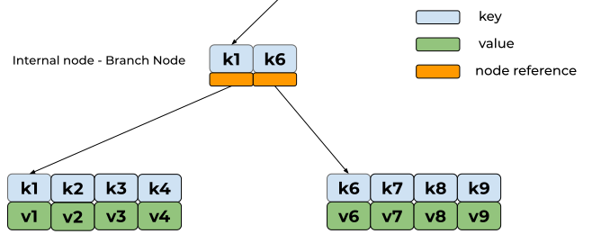

The branch(internal) node contains two children, indexed by key **k1**
and **k6** separately. Unlike common definition, there are not 3 child
references for 2 keys in branch node. All the keys (**k1** <= k < **k6**) will
be stored in the node indexed by **k1** key. The key in branch node will point
to children.

### Insert Key/Value

The insertion process for key/value **d** is like:

* binary search the target leaf node **t**
* search index for key/value **d** in t node and insert it
* call spill for node **t**

```pseudocode
set minKeysPerPage = 2

function spill: node t
  if t is spilled
    return
  mark node t as spilled

  # if there are a lot of keys in one node but the node doesn't take more space,
  # there is no need to split the node. boltdb assumes that one page should
  # have two keys at least.
  #
  # if the node takes more than one page space, and it has more 4 keys, it means
  # the node can be splited into more than two nodes.
  #
  if number of keys in node t <= 2 * minKeysPerPage or size of node t <= 1 page
    return

  # there is edge case about spilling root node
  # splitIntoNodes will create new parent node for the root
  #
  nodes = call splitIntoNodes for node t

  loop n in nodes:
    let nk is first key of node n

    insert key nk into the parent of node t
    mark node n as spilled

  if parent node of t exists
    call spill for parent node of t
  return
```

For example, we have B+ Tree in the following picture. We can add new data
k5/v5 into leaf node L1. The leaf node L1 has 5 keys and it takes more than 1
page. We can split leaf node L1 in a variety of ways. But in order to put more
keys in one node, boltdb uses **maxFillPercent** to split the nodes.

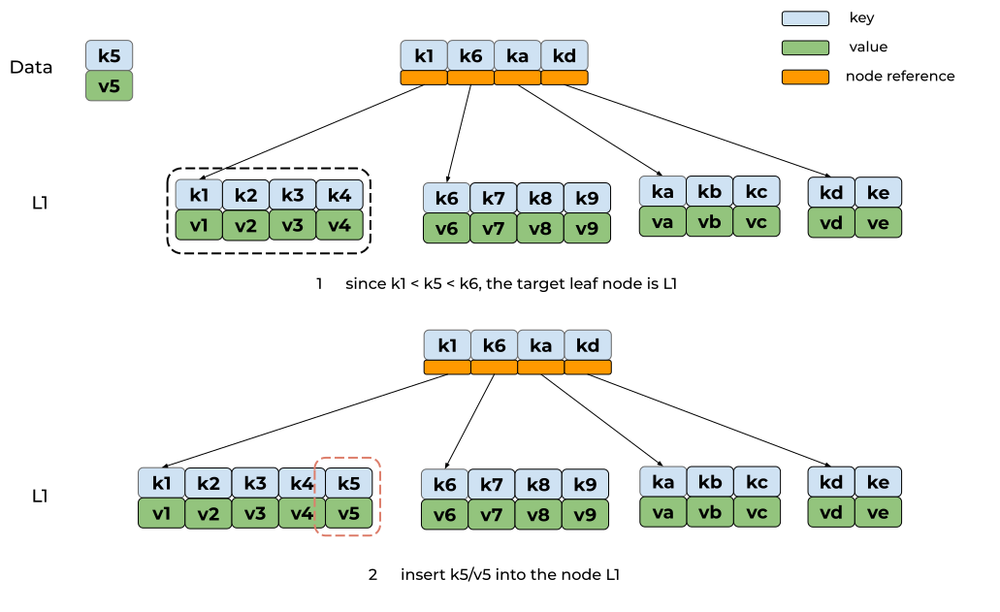

**maxFillPercent** is threshold to make sure that the node has enough key item
in one page. In leaf node L1, the k1/v1, k2/v2 takes more space than threshold,
but k3/v3, k4/v4, k5/v5 don't. Therefore, the leaf node L1 is splited into two
nodes.

```pseudocode
function splitIntoNodes: node t
  let nodes = []node{} # empty slice for node

  while ture
     if t is empty
       break

     t, next = call splitIntoTwos: node t

     appends t into nodes
     t = next
  return nodes

function splitIntoTwos: node t
  let threshold = maxFillPercent * one page size
  let index = 0
  let sum = 0

  for i = 0; i < t.numOfChildren() - minKeysPerPage; i++
    sum += t.children[i].size()
    if i >= minKeysPerPage && sum >= threshold
      index = i
      break

  t, next = split node t by index
  create parent for t and next if t is root node

  return t, next
```

Since the parent of leaf node L1 doesn't have reference for the new node, the
following step will insert first key of each node into the parent node.

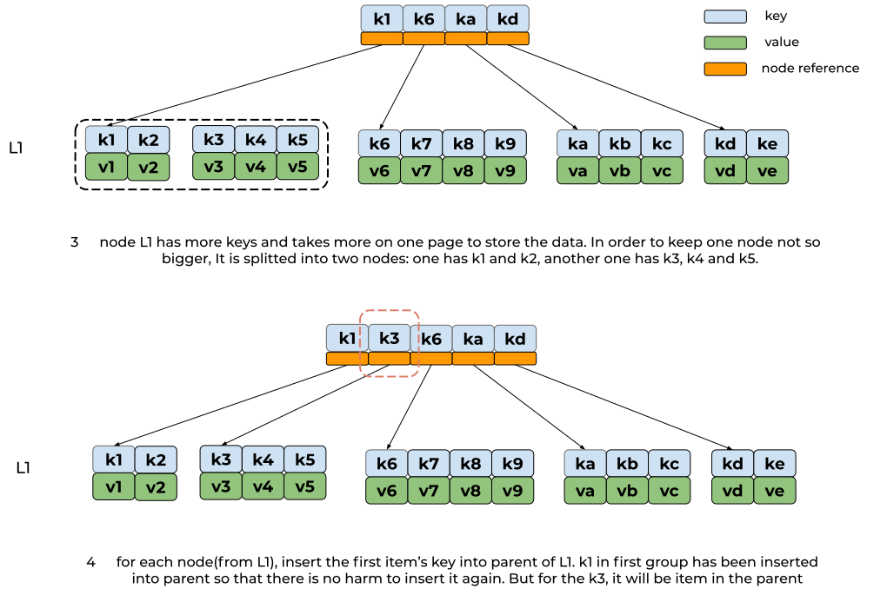

For now, the leaf node L1 has been splited for spill. But the parent node, the
root, has new key **k3**. We just repeat the steps mentioned above to split
the root node.

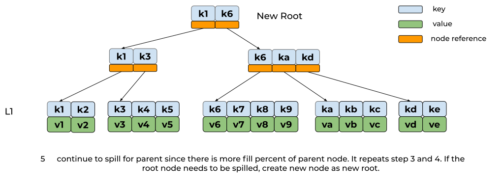

### Deletion

In boltdb, the deletion will use merge action instead of swaping node.

```pseudocode
In boltdb, minKey() for leaf node is 1 and for internal node is 2.

function rebalance: node t
  let threshold = 25% * one page size

  if t.numOfChildren() >= t.minKey() && t.size() >= threshold
    return

  if t is root node
    if t.isLeaf && t.numOfChildren() >= 2
      return

    # there is only one child in root node
    use t.child as new root
    return

  if t.isEmpty
    remove reference from parent of node t
    call rebalance: the parent node of node t
    return

  if t.parent.numOfChildren() > t.minKey()
    let sibling = prevSibling

    # if t is first child of t.parent
    if sibling is nil
      sibling = nextSibling

    merge sibling into node t
    remove sibling from t.parent
    call rebalance: parent node of node t
    return

  panic("unreachable")
```

After multiple deletions, the boltdb will call rebalance for all the leaf nodes.
Let the one of leaf nodes is t. If the node t has enough key items and filled
25% percent of one page, the leaf node t is good.

Assuming the node t doesn't meet requirement mentioned above. If the node t is
empty, we should remove the node t and rebalance its parent node. If the
node is not empty and its parent has children more than minKey,
we can merge the node t with sibling to make sure that the node t has enough
keys. Since we merge the sibling keys into node t, the sibling will be removed
and we also need to rebalance for the parent of node t.

For example, we deletes k3/v3 and k4/v4 from leaf node L1. After deletion, the
leaf node L1 has two keys but it doesn't take 25% percent of one page. We need
to rebalance leaf node L1.

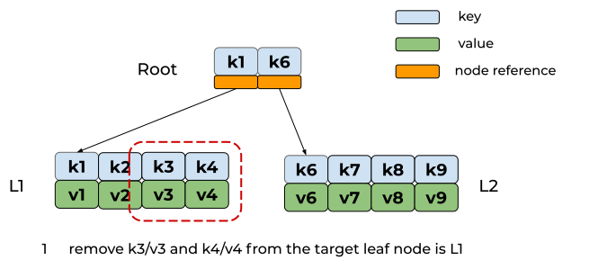

Since the parent of leaf node L1 has two children, the rebalance will merge
the next sibling node L2 into leaf node L1.

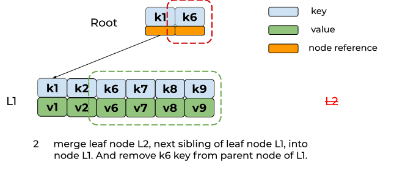

The sibling leaf node L2 has been removed from parent node. We also need to
rebalance the parent node. But the parent node is the root which contains only one
child. The rebalance will remove root node and let the leaf node L1 as new root.

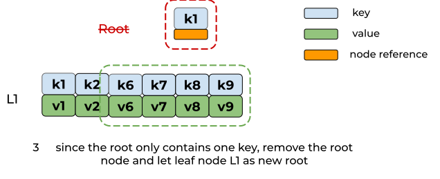

After rebalance, some nodes has new keys with merge action. The nodes might
be spill so that the boltdb will call the spill for each node. We can say that
the deletion consists of **rebalance** and **spill**.

Deletions is called for leaf node and don't touch any branching node. Only
rebalance will delete the key from branching node for removing empty node or
merging two nodes. The parent of node must contain minKey keys at least. If not,
the tree is not a B+ tree at the beginning. The **unreachable line** for panic
is truly unreachable.

Note that the merge action doesn't check the number sibling's children. If the
sibling leaf node is empty, the merge action will be no-op. Since the minKey for
leaf node is 1 in boltdb, the no-op result is acceptable. However, it is tricky.
If we change the minKey, we need to find out the mergable node or other way.

For now, we know the design about B+ Tree in boltdb. Let's move to the
node serialization.

## Node Serialization

The in-memory data needs to be serialized into disk.

Boltdb uses one file to store data and the format of file is page. Each node in
B+ Tree will be represented by page(s). By default, the page size in linux
platform is 4096 bytes.

```
// page.go
type pgid uint64

type page struct {
	// page id
        id       pgid

	// flags indicates type of node. for instance, branching and leaf
        flags    uint16

	// count indicates how many children in this page
        count    uint16

	// overflow indicates the page will take how many pages.
        overflow uint32

	// ptr indicates the payload address
        ptr      uintptr
}

/
// branchPageElement represents a node on a branch page.
type branchPageElement struct {
        pos   uint32
        ksize uint32
        pgid  pgid
}

// leafPageElement represents a node on a leaf page.
type leafPageElement struct {
        flags uint32
        pos   uint32
        ksize uint32
        vsize uint32
}
```

Both `branchPageElement` and `leafPageElement` are used to index the key value.
The `pos` indicates that that address of the key. And with `ksize`, we can
retrieve the key. Therefore, the payload of page will start with
array of `branchPageElement` or `leafPageElement`.

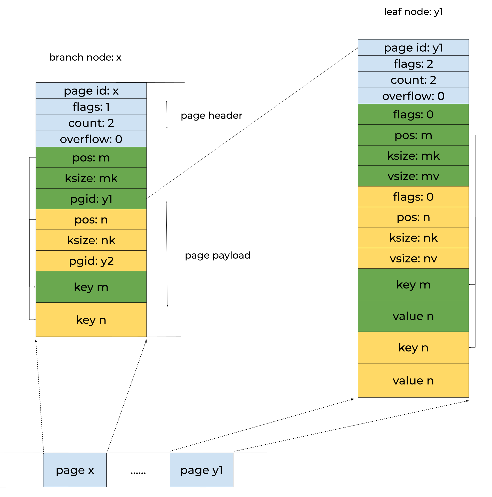

The branch node x has two keys (branchPageElement). Let the `addrX` is the
address for the first `branchPageElement`. The address of first key will be
`addrX + m`. And the first branchPageElement has pgid field with `y1` value,
which means that it is reference to the leaf node y1. The page id makes the
content addressable.

Now we know the storage layout and let's see code to handle serialization in
boltdb.

```go
// node.go

// node represents an in-memory, deserialized page.
type node struct {
	bucket     *Bucket
        isLeaf     bool
	unbalanced bool
        spilled    bool

	// key indicates first key in the node
        key        []byte
        pgid       pgid
        parent     *node

	// children represents the children of branch node.
        children   nodes
        inodes     inodes
}

type nodes []*node

// inode represents branchPageElement or leafPageElement
type inode struct {
        flags uint32
        pgid  pgid
        key   []byte
        value []byte
}
```

`read` function is used to deserialize page into node.
The argument, page `p`, is mapping the page(s) in the disk. In order to read
the page efficently without huge RES memory, the boltdb uses read-only
mode [mmap](https://en.wikipedia.org/wiki/Mmap) the file into memory.
With `unsafe.Pointer`, the page `p` is the data which stored in the disk.

```go
// node.go

// read initializes the node from a page.
func (n *node) read(p *page) {
        n.pgid = p.id
        n.isLeaf = ((p.flags & leafPageFlag) != 0)
        n.inodes = make(inodes, int(p.count))

        for i := 0; i < int(p.count); i++ {
                inode := &n.inodes[i]
                if n.isLeaf {
                        elem := p.leafPageElement(uint16(i))
                        inode.flags = elem.flags
                        inode.key = elem.key()
                        inode.value = elem.value()
                } else {
                        elem := p.branchPageElement(uint16(i))
                        inode.pgid = elem.pgid
                        inode.key = elem.key()
                }
                _assert(len(inode.key) > 0, "read: zero-length inode key")
        }

        // Save first key so we can find the node in the parent when we spill.
        if len(n.inodes) > 0 {
                n.key = n.inodes[0].key
                _assert(len(n.key) > 0, "read: zero-length node key")
        } else {
                n.key = nil
        }
}
```

The `read` function will mapping each key or key/value pair into `inode`.
As mentioned above, both `leafPageElement` and `branchPageElement` have `pos`
field to find the key/value data in the payload. The `key()` and `value()`
function for `leafPageElement` are using `pos` to locate the address.

```go
// page.go

// leafPageElement retrieves the leaf node by index
func (p *page) leafPageElement(index uint16) *leafPageElement {
        n := &((*[0x7FFFFFF]leafPageElement)(unsafe.Pointer(&p.ptr)))[index]
        return n
}

// key returns a byte slice of the node key.
func (n *leafPageElement) key() []byte {
        buf := (*[maxAllocSize]byte)(unsafe.Pointer(n))
        return (*[maxAllocSize]byte)(unsafe.Pointer(&buf[n.pos]))[:n.ksize:n.ksize]
}

// value returns a byte slice of the node value.
func (n *leafPageElement) value() []byte {
        buf := (*[maxAllocSize]byte)(unsafe.Pointer(n))
        return (*[maxAllocSize]byte)(unsafe.Pointer(&buf[n.pos+n.ksize]))[:n.vsize:n.vsize]
}

// branchPageElement retrieves the branch node by index
func (p *page) branchPageElement(index uint16) *branchPageElement {
        return &((*[0x7FFFFFF]branchPageElement)(unsafe.Pointer(&p.ptr)))[index]
}

// key returns a byte slice of the node key.
func (n *branchPageElement) key() []byte {
        buf := (*[maxAllocSize]byte)(unsafe.Pointer(n))
        return (*[maxAllocSize]byte)(unsafe.Pointer(&buf[n.pos]))[:n.ksize]
}
```

If you know how `read` function works, it is easy to read code about `write`
function.

> Note that there are other types of page, such as meta and freelist.
Those pages are used to store the metadata for transaction and mvcc.
The following section will introduce it later.

The node just represents one component of B+ Tree in memory and the bucket is
used to represent the whole B+ Tree in memory.

## Bucket

In boltdb, the collection of key/value pairs are called bucket.
We can say that bucket represents one B+ Tree. The bucket is like namespace,
which can provide multi tenancy functionality. We can store the same key in
different bucket.

boltdb supports sub bucket and the payload for sub bucket will be stored in the
leaf node.

> NOTE: the leafPageElement's flags is used to indicates the data is sub bucket
or normal key/value pair.

```go
// bucket.go

// bucket represents the on-file representation of a bucket.
// This is stored as the "value" of a bucket key. If the bucket is small enough,
// then its root page can be stored inline in the "value", after the bucket
// header. In the case of inline buckets, the "root" will be 0.
type bucket struct {
        root     pgid   // page id of the bucket's root-level page
        sequence uint64 // monotonically incrementing, used by NextSequence()
}
```

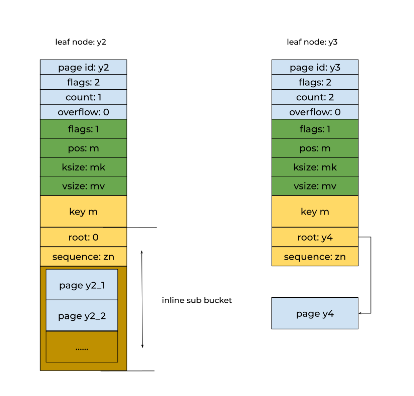

If the sub bucket just contains the few key/value pairs taking few disk space,
the sub bucket will be stored as inline in the leaf node's value payload and the
`root` field for page id will be zero for inline sub bucket.

If the bucket contains sub bucket or reaches threshold for inline storage,
the bucket will be stored in other page linked by the `root` field.

> NOTE: boltdb doesn't store key/values in root bucket. The root bucket only
contains sub buckets. You have to create sub bucket before inserting key/value
pairs.

## Search in Bucket

The Bucket represents B+ Tree with root page id. If the root page id is zero,
the bucket is inline bucket and `page` field in bucket will be reference to
the value address in the leaf node.

```go
// bucket.go

// NOTE: tx field is used to control transaction which we can ignore right now.

// Bucket represents a collection of key/value pairs inside the database.
type Bucket struct {
        *bucket
        tx       *Tx                // the associated transaction
        buckets  map[string]*Bucket // subbucket cache
        page     *page              // inline page reference
        rootNode *node              // materialized node for the root page.
        nodes    map[pgid]*node     // node cache

        // Sets the threshold for filling nodes when they split. By default,
        // the bucket will fill to 50% but it can be useful to increase this
        // amount if you know that your write workloads are mostly append-only.
        //
        // This is non-persisted across transactions so it must be set in every Tx.
        FillPercent float64
}

type bucket struct {
        root     pgid   // page id of the bucket's root-level page
        sequence uint64 // monotonically incrementing, used by NextSequence()
}
```

### Normal Key/Value Pair - Get(key []byte) []byte

The Bucket provides the `Get` API to retrieves value indexed by key if exists.
The `Get` API function is simple with `Cursor`'s help.

```go
// bucket.go

// Get retrieves the value for a key in the bucket.
// Returns a nil value if the key does not exist or if the key is a nested bucket.
// The returned value is only valid for the life of the transaction.
func (b *Bucket) Get(key []byte) []byte {
        k, v, flags := b.Cursor().seek(key)

        // Return nil if this is a bucket.
        if (flags & bucketLeafFlag) != 0 {
                return nil
        }

        // If our target node isn't the same key as what's passed in then return nil.
        if !bytes.Equal(key, k) {
                return nil
        }
        return v
}

// Cursor creates a cursor associated with the bucket.
// The cursor is only valid as long as the transaction is open.
// Do not use a cursor after the transaction is closed.
func (b *Bucket) Cursor() *Cursor {
        // Update transaction statistics.
        b.tx.stats.CursorCount++

        // Allocate and return a cursor.
        return &Cursor{
                bucket: b,
                stack:  make([]elemRef, 0),
        }
}
```

The `Cursor` is used to maintain path from root node to target leaf node during
traversing. The `bucket` field in `Cursor` is reference to the bucket where it
traverses for cache or statistics purposes. And the `stack` field is to store
the nodes in traversing path from root.

> NOTE: cache is the topic of next section :).

```go
// cursor.go

// Cursor represents an iterator that can traverse over all key/value pairs in a bucket in sorted order.
// Cursors see nested buckets with value == nil.
// Cursors can be obtained from a transaction and are valid as long as the transaction is open.
type Cursor struct {
        bucket *Bucket
        stack  []elemRef
}

// elemRef represents a reference to an element on a given page/node.
type elemRef struct {
        page  *page
	node  *node
	index int
}
```

Before search, the cursor will cleanup the `stack` slice and call the `search`
to traverse the tree from root node.

```go
// cursor.go

// seek moves the cursor to a given key and returns it.
// If the key does not exist then the next key is used.
func (c *Cursor) seek(seek []byte) (key []byte, value []byte, flags uint32) {
        _assert(c.bucket.tx.db != nil, "tx closed")

        // Start from root page/node and traverse to correct page.
        c.stack = c.stack[:0]
        c.search(seek, c.bucket.root)

        // If this is a bucket then return a nil value.
        return c.keyValue()
}

// search recursively performs a binary search against a given page/node until it finds a given key.
func (c *Cursor) search(key []byte, pgid pgid) {
        p, n := c.bucket.pageNode(pgid)
        if p != nil && (p.flags&(branchPageFlag|leafPageFlag)) == 0 {
                panic(fmt.Sprintf("invalid page type: %d: %x", p.id, p.flags))
        }
        e := elemRef{page: p, node: n}
        c.stack = append(c.stack, e)

        // If we're on a leaf page/node then find the specific node.
        if e.isLeaf() {
                c.nsearch(key)
                return
        }

        if n != nil {
                c.searchNode(key, n)
                return
        }
        c.searchPage(key, p)
}
```

`search` will call `c.bucket.pageNode` to get page or node. As we know, the
node represents in-memory object and the page represents the object in the disk.
The `c.bucket.pageNode` will return cache first if exists. If not, it will
return `page` object to `search`.

The page or node will be used to init `elemRef` object in the `stack` of Cursor.
The top `elemRef` of `stack` is the node used currently. But the `index` of
`elemRef` still is empty right now.

If the node is branch node, `search` will call `searchNode` or `searchPage` to
update the `index` of top `elemRef` in the stack with binary search. And then
`searchNode` or `searchPage` will call `search` recursively to traverse next node
until the node is leaf node. The `nsearch` for leaf node will update the
`index` for top `elemRef` in the stack and return.

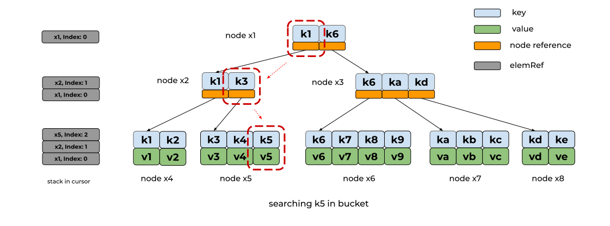

The `Get` API function will call the Cursor's `keyValue()` to return key/value
data with top of `elemRef` from traversing path. If the value is nil,
the key might not exist or is used to reference to sub bucket.

## Sub Bucket - Bucket(name []byte) *Bucket

The search sub bucket is the same to the normal key/value pair.

```go
// bucket.go

// Bucket retrieves a nested bucket by name.
// Returns nil if the bucket does not exist.
// The bucket instance is only valid for the lifetime of the transaction.
func (b *Bucket) Bucket(name []byte) *Bucket {
        if b.buckets != nil {
                if child := b.buckets[string(name)]; child != nil {
                        return child
                }
        }

        // Move cursor to key.
        c := b.Cursor()
        k, v, flags := c.seek(name)

        // Return nil if the key doesn't exist or it is not a bucket.
        if !bytes.Equal(name, k) || (flags&bucketLeafFlag) == 0 {
                return nil
        }

        // Otherwise create a bucket and cache it.
        var child = b.openBucket(v)
        if b.buckets != nil {
                b.buckets[string(name)] = child
        }

        return child
}

// Helper method that re-interprets a sub-bucket value
// from a parent into a Bucket
func (b *Bucket) openBucket(value []byte) *Bucket {
        var child = newBucket(b.tx)

        // If unaligned load/stores are broken on this arch and value is
        // unaligned simply clone to an aligned byte array.
        unaligned := brokenUnaligned && uintptr(unsafe.Pointer(&value[0]))&3 != 0

        if unaligned {
                value = cloneBytes(value)
        }

        // If this is a writable transaction then we need to copy the bucket entry.
        // Read-only transactions can point directly at the mmap entry.
        if b.tx.writable && !unaligned {
                child.bucket = &bucket{}
                *child.bucket = *(*bucket)(unsafe.Pointer(&value[0]))
        } else {
                child.bucket = (*bucket)(unsafe.Pointer(&value[0]))
        }

        // Save a reference to the inline page if the bucket is inline.
        if child.root == 0 {
                child.page = (*page)(unsafe.Pointer(&value[bucketHeaderSize]))
        }

        return &child
}
```

Note that the bucket might be inline type and the `openBucket` will init `page`
field in Bucket struct if the `root` page id is zero.

### Other APIs

Bucket provides several APIs to traverse node, such as `First`, `Next`. Those
APIs are also based on the Cursor. It is easy to read code to get the point if
the above content is clear to you :)

## Copy on Write

For now, we have seen `cache` word in the codebase. So when does boltdb update
cache for the node?

Basically, if there is only read operation in boltdb, there is no need to use
cache because boltdb already uses mmap file into memory. All the pages come from
memory. But if there exists one request to modify the bucket, we need to copy
all the related pages into cache.

One bucket will maintain cache for sub buckets and nodes in current bucket.
Both `buckets` and `nodes` fields in `Bucket` are used for cache and only
available for write.

```go
// bucket.go

// newBucket returns a new bucket associated with a transaction.
func newBucket(tx *Tx) Bucket {
        var b = Bucket{tx: tx, FillPercent: DefaultFillPercent}
        if tx.writable {
                b.buckets = make(map[string]*Bucket)
                b.nodes = make(map[pgid]*node)
        }
        return b
}
```

Just keep **Copy on write** in mind when you read boltdb codebase.
And how to update cache is related to transaction.

## Transaction

boltdb provides transaction feature so that the user can commit multiple
changesets in one time. All the transactions start from root bucket and the
writable transaction needs allocate new page or release existing page for
changeset.

### Metadata/Freelist Node

The data about root bucket and free pages are persisted in meta and freelist
page.

When we initializes a new boltdb instance, boltdb API will insert four pages
into the empty database file, including two meta pages, one freelist page and
one empty leaf node.

```go
// db.go

type meta struct {
	// boltdb uses magic bytes(0xED0CDAED) to mark the file is boltdb
	// database.
        magic    uint32

	// version indicates the format version of file
        version  uint32

	// pageSize is used to set page size, by default, 4096 in linux
        pageSize uint32

	// not using right now
        flags    uint32

	// root is reference to the page for root node.
        root     bucket

	// freelist is reference to the page which stores free page ids
        freelist pgid

	// pgid indicates max page id in this transaction id, txid
        pgid     pgid

	// txid indicates current transaction id for root field.
	// txid is like version id
        txid     txid

	// checksum is used to calculate hash value for the meta page.
	// it can be used to validate the meta.
        checksum uint64
}

// init creates a new database file and initializes its meta pages.
func (db *DB) init() error {
        // Create two meta pages on a buffer.
        buf := make([]byte, db.pageSize*4)
        for i := 0; i < 2; i++ {
                p := db.pageInBuffer(buf[:], pgid(i))
                p.id = pgid(i)
                p.flags = metaPageFlag

                // Initialize the meta page.
                m := p.meta()
                m.magic = magic
                m.version = version
                m.pageSize = uint32(db.pageSize)
                m.freelist = 2
                m.root = bucket{root: 3}
                m.pgid = 4
                m.txid = txid(i)
                m.checksum = m.sum64()
        }

        // Write an empty freelist at page 3.
        p := db.pageInBuffer(buf[:], pgid(2))
        p.id = pgid(2)
        p.flags = freelistPageFlag
        p.count = 0

        // Write an empty leaf page at page 4.
        p.id = pgid(3)
        p.flags = leafPageFlag
        p.count = 0

        // Write the buffer to our data file.
        if _, err := db.ops.writeAt(buf, 0); err != nil {
                return err
        }
        if err := fdatasync(db); err != nil {
                return err
        }

        return nil
}
```

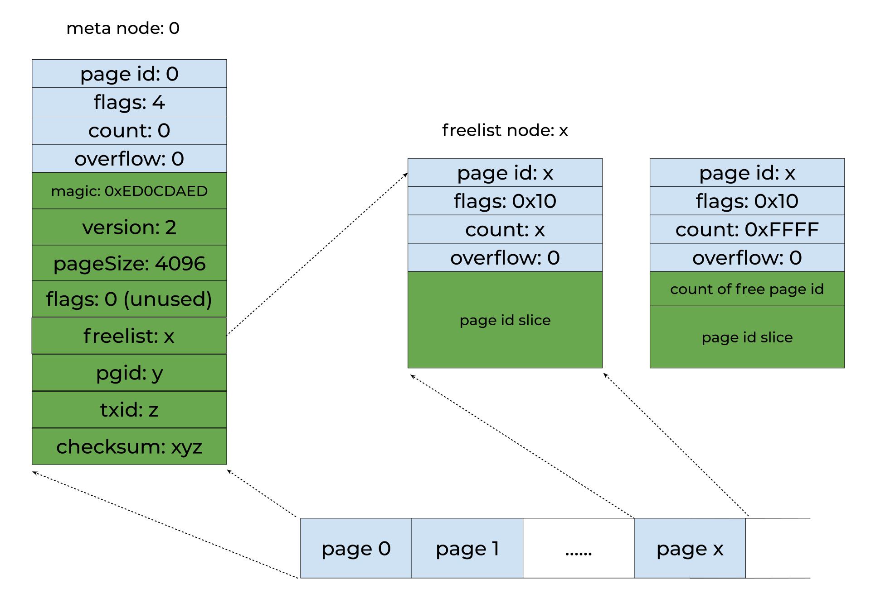

The payload for freelist node is array of free page ids and the `count` field in
page header is array length. Since the `count` field is `uint16` (max value is
`0xFFFF`), the freelist will use first element to store the length and set
`count` as `0xFFFF` if the `count` > `0xFFFF`.

If initializes boltdb with existing file, the `Open` function will read first
page to read page size since there might be different between default page size
and existing one.

```go
// db.go

// Open creates and opens a database at the given path.
// If the file does not exist then it will be created automatically.
// Passing in nil options will cause Bolt to open the database with the default options.
func Open(path string, mode os.FileMode, options *Options) (*DB, error) {

	...

	 // Initialize the database if it doesn't exist.
	if info, err := db.file.Stat(); err != nil {
	    _ = db.close()
	    return nil, err
	} else if info.Size() == 0 {
	    // Initialize new files with meta pages.
	    if err := db.init(); err != nil {
		// clean up file descriptor on initialization fail
		_ = db.close()
		return nil, err
	    }
	} else {
		// Read the first meta page to determine the page size.
		var buf [0x1000]byte
		// If we can't read the page size, but can read a page, assume
		// it's the same as the OS or one given -- since that's how the
		// page size was chosen in the first place.
		//
		// If the first page is invalid and this OS uses a different
		// page size than what the database was created with then we
		// are out of luck and cannot access the database.
		//
		// TODO: scan for next page
		if bw, err := db.file.ReadAt(buf[:], 0); err == nil && bw == len(buf) {
			if m := db.pageInBuffer(buf[:], 0).meta(); m.validate() == nil {
				db.pageSize = int(m.pageSize)
			}
		} else {
			_ = db.close()
			return nil, ErrInvalid
		}
	}

	...

}
```

With meta page, the boltdb instance knows where the root node is. Since the meta
page provides the reference to root node and boltdb uses mmap to read file, it
is easy to restore boltdb instance.

### How to start transaction?

The boltdb uses `DB` struct as database instance which provides several features

* increasing database size automatically when there is no enough free pages
* concurrent supports for read transaction but only one write transaction at
a time

```
// db.go
// NOTE: remove the options and keep the DB struct is simple and easy to reason about

// DB represents a collection of buckets persisted to a file on disk.
// All data access is performed through transactions which can be obtained through the DB.
// All the functions on DB will return a ErrDatabaseNotOpen if accessed before Open() is called.
type DB struct {
        ...

	// dataref, data and datasz are used to manage the mmap memory
	// the boltdb will un-mmap and re-mmap the file if the size of file grows
        dataref  []byte // mmap'ed readonly, write throws SEGV
        data     *[maxMapSize]byte
        datasz   int

        filesz   int // current on disk file size
        meta0    *meta
        meta1    *meta
        pageSize int
        opened   bool
        rwtx     *Tx
        txs      []*Tx
        stats    Stats

	...

	rwlock   sync.Mutex   // Allows only one writer at a time.
        metalock sync.Mutex   // Protects meta page access.
        mmaplock sync.RWMutex // Protects mmap access during remapping.

	...
}
```

The `dataref`, `data` and `datasz` fields in `DB` are used to manage the mmap
result. When the database size grows, the boltdb instance will re-mmap database.
And the `mmaplock` field in `DB` struct is used to make sure that the
increasing database size operation needs to acquire the lock because the
existing data from mmap memory will be invalid after re-mmap.

The `rwtx` field in `DB` is reference to current writable transaction and
the `txs` field is reference to opening read-only transactions. You can tell
that there is only writable transaction at a time and the `rwtx` field will be
protected by `rwlock` mutex.

So when we start a readonly or writable transaction, we can call the `DB.Begin()`
to initializes transaction thing.

```
// db.go

func (db *DB) Begin(writable bool) (*Tx, error) {
        if writable {
                return db.beginRWTx()
        }
        return db.beginTx()
}
```

For the readonly transaction, it will `RLock` for `mmaplock` to make sure that
the increasing size operation doesn't impact the opening readonly transaction.
And it locks `metalock` to copy meta page during initialization.

```
// db.go

func (db *DB) beginTx() (*Tx, error) {
        // Lock the meta pages while we initialize the transaction. We obtain
        // the meta lock before the mmap lock because that's the order that the
        // write transaction will obtain them.
        db.metalock.Lock()

        // Obtain a read-only lock on the mmap. When the mmap is remapped it will
        // obtain a write lock so all transactions must finish before it can be
        // remapped.
        db.mmaplock.RLock()

        // Exit if the database is not open yet.
        if !db.opened {
                db.mmaplock.RUnlock()
                db.metalock.Unlock()
                return nil, ErrDatabaseNotOpen
        }

        // Create a transaction associated with the database.
        t := &Tx{}
        t.init(db)

        // Keep track of transaction until it closes.
        db.txs = append(db.txs, t)
        n := len(db.txs)

        // Unlock the meta pages.
        db.metalock.Unlock()

	...

}
```

The writable transaction is like readonly transaction. But it doesn't lock
the `mmaplock` field and only locks it if nessecery. You can see that both
writable and readonly transactions can be handled in the same time if there is
no increasing database size request.

```
// db.go

func (db *DB) beginRWTx() (*Tx, error) {
        // If the database was opened with Options.ReadOnly, return an error.
        if db.readOnly {
                return nil, ErrDatabaseReadOnly
        }

        // Obtain writer lock. This is released by the transaction when it closes.
        // This enforces only one writer transaction at a time.
        db.rwlock.Lock()

        // Once we have the writer lock then we can lock the meta pages so that
        // we can set up the transaction.
        db.metalock.Lock()
        defer db.metalock.Unlock()

        // Exit if the database is not open yet.
        if !db.opened {
                db.rwlock.Unlock()
                return nil, ErrDatabaseNotOpen
        }

        // Create a transaction associated with the database.
        t := &Tx{writable: true}
        t.init(db)
        db.rwtx = t
        db.freePages()
        return t, nil
}
```

> NOTE: The writable transaction will call `db.freePages` to release the
frees into freelist. It is related to MVCC[(MultiVersion Concurrency Control)](https://en.wikipedia.org/wiki/Multiversion_concurrency_control).

The transaction is represented by `Tx` struct. The one of fields is `meta` which
is for meta page. Since the boltdb instance maintains two meta pages, which one
will be used?

As mentioned above, each meta page maintains transaction id as `txid` field.
The `txid` field represents version id and the bigger one is latest. The
transaction prefers to use latest one.

```go
// tx.go

type Tx struct {
        writable       bool
        managed        bool
	// reference to the boltdb instance
        db             *DB
	// copy one meta page
        meta           *meta
	// 
        root           Bucket
        pages          map[pgid]*page
        stats          TxStats
        commitHandlers []func()

        // WriteFlag specifies the flag for write-related methods like WriteTo().
        // Tx opens the database file with the specified flag to copy the data.
        //
        // By default, the flag is unset, which works well for mostly in-memory
        // workloads. For databases that are much larger than available RAM,
        // set the flag to syscall.O_DIRECT to avoid trashing the page cache.
        WriteFlag int
}

// init initializes the transaction.
func (tx *Tx) init(db *DB) {
        tx.db = db
        tx.pages = nil

        // Copy the meta page since it can be changed by the writer.
        tx.meta = &meta{}
        db.meta().copy(tx.meta)

        // Copy over the root bucket.
        tx.root = newBucket(tx)
        tx.root.bucket = &bucket{}
        *tx.root.bucket = tx.meta.root

        // Increment the transaction id and add a page cache for writable transactions.
        if tx.writable {
                tx.pages = make(map[pgid]*page)
                tx.meta.txid += txid(1)
        }
}

// meta retrieves the current meta page reference.
func (db *DB) meta() *meta {
        // We have to return the meta with the highest txid which doesn't fail
        // validation. Otherwise, we can cause errors when in fact the database is
        // in a consistent state. metaA is the one with the higher txid.
        metaA := db.meta0
        metaB := db.meta1
        if db.meta1.txid > db.meta0.txid {
                metaA = db.meta1
                metaB = db.meta0
        }

        // Use higher meta page if valid. Otherwise fallback to previous, if valid.
        if err := metaA.validate(); err == nil {
                return metaA
        } else if err := metaB.validate(); err == nil {
                return metaB
        }

        // This should never be reached, because both meta1 and meta0 were validated
        // on mmap() and we do fsync() on every write.
        panic("bolt.DB.meta(): invalid meta pages")
}
```

The `tx.init()` will call `db.meta()` to retrieve the mata page. The
`db.meta()` prefers to use latest version. Because there is any problems about
commit which makes the latest version unavailable. For this case, the `db.meta()`
will fall back to use old version if it is available. That is why boltdb uses two
meta pages.

> NOTE: When writable transaction commits changeset, boltdb instance will
overwrite the old version meta page. It make sure that the current version is
available and becomes old version for failure.

And the boltdb also supports MVCC so that the `tx.init()` initializer will copy
the latest available meta page just in case that the concurrent writable
transaction updates the meta.

You can tell that each `Tx` maintains one version of bucket. The `Tx`
provides `Bucket` function to retrieve sub bucket. There is no `Get` function
in the root bucket. The root bucket only maintains the sub buckets.

```go
// tx.go

// Bucket retrieves a bucket by name.
// Returns nil if the bucket does not exist.
// The bucket instance is only valid for the lifetime of the transaction.
func (tx *Tx) Bucket(name []byte) *Bucket {
        return tx.root.Bucket(name)
}
```

When you locate the target bucket, you can use `Put`, `Delete`, `CreateBucket`
and `DeleteBucket` functions to apply your changeset in transaction. For
example, there is sub bucket named by `myBucket` and we can `Put` the key/value
`answer/30` pair into the sub bucket.

```go
db.Update(func(tx *bolt.Tx) error {
	b := tx.Bucket([]byte("myBucket"))
	return b.Put([]byte("answer"), []byte("30"))
})
```

The `db.Update` initializes writable transaction and commit the changeset if
the change execution is successful. And the `db.View` will initialize readonly
transaction. Both two functions wrap the `db.Begin()`, `tx.Commit()` and
`tx.Rollback()` as helper.

### Recap Rebalance and Spill in `tx.Commit()`

When tx handles `Commit`, the database might be too large to traverse all nodes
for rebalance and spill. Since boltdb caches the nodes which modified by
`Put/Delete/CreateBucket/DeleteBucket` APIs, it is good enough to traverse
all the cached nodes for rebalance and spill.

So when does boltdb cache the node?

Let's dive into the `Put` function. As mentioned above, the search function is
handled by the `Cursor` instance. When the `Cursor` figures out the path from
root node (current bucket) to target leaf node, the `Put` function will call
the `c.node()` to cache all nodes in the path.

```go
// bucket.go

// Put sets the value for a key in the bucket.
// If the key exist then its previous value will be overwritten.
// Supplied value must remain valid for the life of the transaction.
// Returns an error if the bucket was created from a read-only transaction, if the key is blank, if the key is too large, or if the value is too large.
func (b *Bucket) Put(key []byte, value []byte) error {
        if b.tx.db == nil {
                return ErrTxClosed
        } else if !b.Writable() {
                return ErrTxNotWritable
        } else if len(key) == 0 {
                return ErrKeyRequired
        } else if len(key) > MaxKeySize {
                return ErrKeyTooLarge
        } else if int64(len(value)) > MaxValueSize {
                return ErrValueTooLarge
        }

        // Move cursor to correct position.
        c := b.Cursor()
        k, _, flags := c.seek(key)

        // Return an error if there is an existing key with a bucket value.
        if bytes.Equal(key, k) && (flags&bucketLeafFlag) != 0 {
                return ErrIncompatibleValue
        }

        // Insert into node.
        key = cloneBytes(key)
        c.node().put(key, key, value, 0, 0)

        return nil
}
```

The `c.node()` will cache the root node first by
`c.bucket.node(c.stack[0].page.id, nil)`. And then it caches the remaining node
by traversing the path represented by `c.stack`.

Since the bucket represents B+ Tree, the cached nodes will be stored in the
`Bucket` instance. That is why that `node` and `Cursor` instance need
reference to the current bucket.

> NOTE: The `rootNode` field in `Bucket` struct is reference to the cached root
node.

```go
// cursor.go

// node returns the node that the cursor is currently positioned on.
func (c *Cursor) node() *node {
        _assert(len(c.stack) > 0, "accessing a node with a zero-length cursor stack")

        // If the top of the stack is a leaf node then just return it.
        if ref := &c.stack[len(c.stack)-1]; ref.node != nil && ref.isLeaf() {
                return ref.node
        }

        // Start from root and traverse down the hierarchy.
        var n = c.stack[0].node
        if n == nil {
                n = c.bucket.node(c.stack[0].page.id, nil)
        }
        for _, ref := range c.stack[:len(c.stack)-1] {
                _assert(!n.isLeaf, "expected branch node")
                n = n.childAt(ref.index)
        }
        _assert(n.isLeaf, "expected leaf node")
        return n
}

// node.go

// childAt returns the child node at a given index.
func (n *node) childAt(index int) *node {
        if n.isLeaf {
                panic(fmt.Sprintf("invalid childAt(%d) on a leaf node", index))
        }
        return n.bucket.node(n.inodes[index].pgid, n)
}

// bucket.go

// node creates a node from a page and associates it with a given parent.
func (b *Bucket) node(pgid pgid, parent *node) *node {
        _assert(b.nodes != nil, "nodes map expected")

        // Retrieve node if it's already been created.
        if n := b.nodes[pgid]; n != nil {
                return n
        }

        // Otherwise create a node and cache it.
        n := &node{bucket: b, parent: parent}
        if parent == nil {
                b.rootNode = n
        } else {
                parent.children = append(parent.children, n)
        }

        // Use the inline page if this is an inline bucket.
        var p = b.page
        if p == nil {
                p = b.tx.page(pgid)
        }

        // Read the page into the node and cache it.
        n.read(p)
        b.nodes[pgid] = n

        // Update statistics.
        b.tx.stats.NodeCount++

        return n
}
```

The `CreateBucket/Delete/DeleteBucket` will do the same things. After cache,
the following operations about insertion and deletion are on the cache.
And then `tx.Commit` will help us to persists the change into disk.

> NOTE: There is tip when you read the codebase. The `Bucket.node()` function
is used to setup cache. Both `Cursor.node()` and `node.childAt` base on this.

In order to make code easier to read, let's split the `tx.Commit` function into
two parts: first part is for rebalance and spill, and second part is for writing
into disk.

In first part, the `tx.Commit` will call `rebalance` and `spill` sequencely.
As mentioned above, the `rebalance` will merge nodes together, which make
merged node spill. That is why that the `spill` is always called after
`rebalance`.

```go
// tx.go

// Commit writes all changes to disk and updates the meta page.
// Returns an error if a disk write error occurs, or if Commit is
// called on a read-only transaction.
func (tx *Tx) Commit() error {

	...

        var startTime = time.Now()
        tx.root.rebalance()
        if tx.stats.Rebalance > 0 {
                tx.stats.RebalanceTime += time.Since(startTime)
        }

        // spill data onto dirty pages.
        startTime = time.Now()
        if err := tx.root.spill(); err != nil {
                tx.rollback()
                return err
        }
        tx.stats.SpillTime += time.Since(startTime)

        // Free the old root bucket.
        tx.meta.root.root = tx.root.root

	...

}
```

The `tx.Commit` will call the rebalance from root bucket and then sub buckets.
Those buckets and nodes are cached.

```go
// bucket.go

// rebalance attempts to balance all nodes.
func (b *Bucket) rebalance() {
        for _, n := range b.nodes {
                n.rebalance()
        }
        for _, child := range b.buckets {
                child.rebalance()
        }
}
```

The spill will call for sub bucket first because the root node might be splited
into two nodes. No matter what the type of sub bucket is, the current root node
will be updated if there is any update in the sub bucket. We can see that
if there is one leaf node updated, the nodes from root bucket (from meta page)
to the leaf node will be updated.

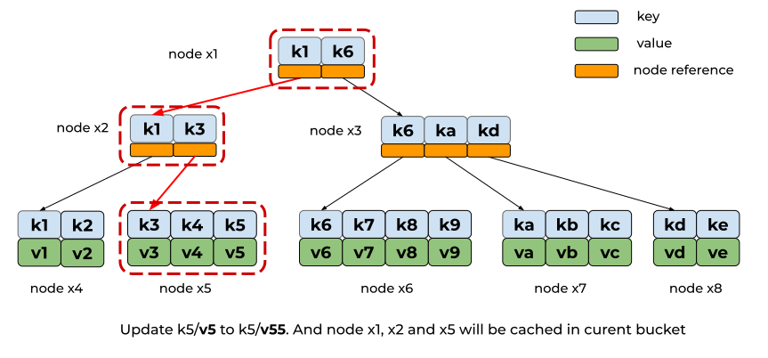

```go
// bucket.go

// spill writes all the nodes for this bucket to dirty pages.
func (b *Bucket) spill() error {
        // Spill all child buckets first.
        for name, child := range b.buckets {
                // If the child bucket is small enough and it has no child buckets then
                // write it inline into the parent bucket's page. Otherwise spill it
                // like a normal bucket and make the parent value a pointer to the page.
                var value []byte
                if child.inlineable() {
                        child.free()
                        value = child.write()
                } else {
                        if err := child.spill(); err != nil {
                                return err
                        }

                        // Update the child bucket header in this bucket.
                        value = make([]byte, unsafe.Sizeof(bucket{}))
                        var bucket = (*bucket)(unsafe.Pointer(&value[0]))
                        *bucket = *child.bucket
                }

                // Skip writing the bucket if there are no materialized nodes.
                if child.rootNode == nil {
                        continue
                }

                // Update parent node.
                var c = b.Cursor()
                k, _, flags := c.seek([]byte(name))
                if !bytes.Equal([]byte(name), k) {
                        panic(fmt.Sprintf("misplaced bucket header: %x -> %x", []byte(name), k))
                }
                if flags&bucketLeafFlag == 0 {
                        panic(fmt.Sprintf("unexpected bucket header flag: %x", flags))
                }
                c.node().put([]byte(name), []byte(name), value, 0, bucketLeafFlag)
        }

	// Ignore if there's not a materialized root node.
        if b.rootNode == nil {
                return nil
        }

        // Spill nodes.
        if err := b.rootNode.spill(); err != nil {
                return err
        }
        b.rootNode = b.rootNode.root()

        // Update the root node for this bucket.
        if b.rootNode.pgid >= b.tx.meta.pgid {
                panic(fmt.Sprintf("pgid (%d) above high water mark (%d)", b.rootNode.pgid, b.tx.meta.pgid))
        }
        b.root = b.rootNode.pgid

        return nil
}
```

In order to support MVCC, the boltdb will allocate the free page for each cached
node. The `spill` will call the `tx.db.freelist.free` to release existing
page(s) and call the `tx.allocate` to get page(s) for the updated node.

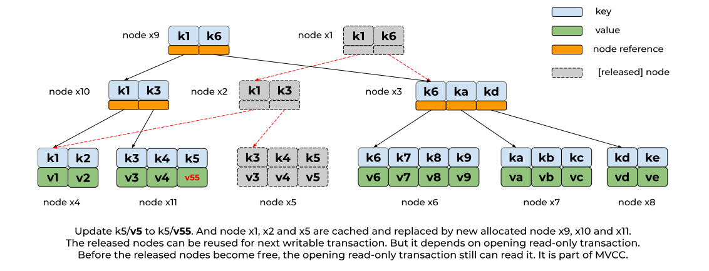

```
// node.go

// spill writes the nodes to dirty pages and splits nodes as it goes.
// Returns an error if dirty pages cannot be allocated.
func (n *node) spill() error {

	...

	// Split nodes into appropriate sizes. The first node will always be n.
        var nodes = n.split(tx.db.pageSize)
        for _, node := range nodes {
                // Add node's page to the freelist if it's not new.
                if node.pgid > 0 {
                        tx.db.freelist.free(tx.meta.txid, tx.page(node.pgid))
                        node.pgid = 0
                }

                // Allocate contiguous space for the node.
                p, err := tx.allocate((node.size() + tx.db.pageSize - 1) / tx.db.pageSize)
                if err != nil {
                        return err
                }

		// Write the node.
                if p.id >= tx.meta.pgid {
                        panic(fmt.Sprintf("pgid (%d) above high water mark (%d)", p.id, tx.meta.pgid))
                }
                node.pgid = p.id
                node.write(p)
                node.spilled = true

		...
	}

	...

}
```

After `rebalance` and `spill`, all the updated nodes are ready to be persisted
into disk. Therefore, the second part of `tx.Commit` is to write the pages into
disk and re-mmap the file if nessecery.

> NOTE: re-mmap will be handled in `tx.commitFreelist()`.

The `tx.writeMeta` will overwrite older version of meta page in `tx.Commit` so
that there are always two versions for latest and second latest.

```go
// tx.go

func (tx *Tx) Commit() error {
	
	...

	// Free the old freelist because commit writes out a fresh freelist.
        if tx.meta.freelist != pgidNoFreelist {
                tx.db.freelist.free(tx.meta.txid, tx.db.page(tx.meta.freelist))
        }

        if !tx.db.NoFreelistSync {
                err := tx.commitFreelist()
                if err != nil {
                        return err
                }
        } else {
                tx.meta.freelist = pgidNoFreelist
        }

        // Write dirty pages to disk.
        startTime = time.Now()
        if err := tx.write(); err != nil {
                tx.rollback()
                return err
        }

	...

	// Write meta to disk.
        if err := tx.writeMeta(); err != nil {
                tx.rollback()
                return err
        }
        tx.stats.WriteTime += time.Since(startTime)

        // Finalize the transaction.
        tx.close()

	...

}
```

All the write operations will use `fsync` call to flush dirty pages into disk.

### Pending and Free Pages

boltdb always uses new free pages to store the updated nodes. The existing pages
are released and still can be read by opening readonly transaction. And both
*released* and *free* pages are managed by `freelist`.

The `pending` field in `freelist` struct is used to manage the *released* pages
from writable transaction which can not be reuse for next round. boltdb calls
the *released* page as *pending* page. And the `ids` field caches all the
allocatable page IDs. The `allocs` field will store the transaction ID that
allocated a page.

```go
// freelist.go

// freelist represents a list of all pages that are available for allocation.
// It also tracks pages that have been freed but are still in use by open transactions.
type freelist struct {
        ids            []pgid                      // all free and available free page ids.
        allocs         map[pgid]txid               // mapping of txid that allocated a pgid.
        pending        map[txid]*txPending         // mapping of soon-to-be free page ids by tx.
        cache          map[pgid]bool               // fast lookup of all free and pending page ids.

	...

}

// txPending holds a list of pgids and corresponding allocation txns
// that are pending to be freed.
type txPending struct {
        ids              []pgid
        alloctx          []txid // txids allocating the ids
        lastReleaseBegin txid   // beginning txid of last matching releaseRange
}
```

When we call `freelist.free()` to release existing page(s), the `freelist`
will initialize the `txPending` to store the transaction ID for pending pages.
The `allocs` field in `txPending` struct is used to record the transaction
ID that allocated the page.

So in one transaction version of bucket, it can contain pages allocated from
different transaction ID. For the branch and leaf type of pages allocated
before opening current `DB` instance, boltdb uses zero value to represent
a transaction ID before current opening transaction IDs. Since the
`freelist` page is not tree and represents array of IDs, the allocated
transaction ID is always last transaction.

```go
// freelist.go

// free releases a page and its overflow for a given transaction id.
// If the page is already free then a panic will occur.
func (f *freelist) free(txid txid, p *page) {
        if p.id <= 1 {
                panic(fmt.Sprintf("cannot free page 0 or 1: %d", p.id))
        }

        // Free page and all its overflow pages.
        txp := f.pending[txid]
        if txp == nil {
                txp = &txPending{}
                f.pending[txid] = txp
        }
        allocTxid, ok := f.allocs[p.id]
        if ok {
                delete(f.allocs, p.id)
        } else if (p.flags & freelistPageFlag) != 0 {
                // Freelist is always allocated by prior tx.
                allocTxid = txid - 1
        }

        for id := p.id; id <= p.id+pgid(p.overflow); id++ {
                // Verify that page is not already free.
                if f.cache[id] {
                        panic(fmt.Sprintf("page %d already freed", id))
                }
                // Add to the freelist and cache.
                txp.ids = append(txp.ids, id)
                txp.alloctx = append(txp.alloctx, allocTxid)
                f.cache[id] = true
        }
}
```

When do the pending pages become allocatable?

When boltdb starts writable transaction, it will call `db.freePages()` to
make the pending pages become free pages.

```go
// db.go

func (db *DB) beginRWTx() (*Tx, error) {

	...

        // Create a transaction associated with the database.
        t := &Tx{writable: true}
        t.init(db)
        db.rwtx = t
        db.freePages()
	return t, nil
}
```

The `txs` field in `DB` struct stores the opening read-only transaction IDs,
which can help `db.freePages()` to know which page can be allocatable.

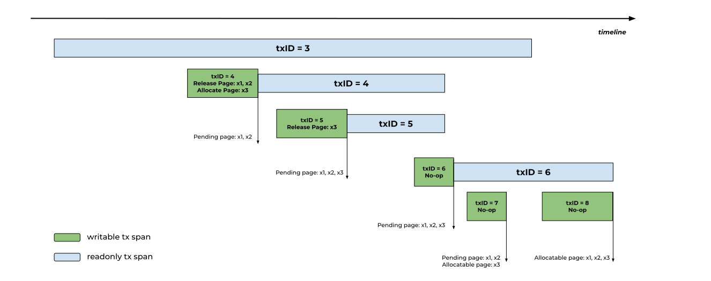

For example, the writable `txid=4` transaction  releases page **x1** and **x2**
into pending pages. It also uses free page **x3**. When user starts writable
`txid=5` transaction, since page **x1** and **x2** were allocated before
readonly `txid=3` transaction, and readonly `txid=3` transaction is still
opening, the two pages are still using by previous opening transactions.
Page **x1** and **x2** are remaining *pending*.

As the writable `txid=6` transaction starts, there are three opening
transactions using page **x1**, **x2** and **x3**. For the writable
`txid=7` transaction, there two only opening transactions. And the page
**x3** is allocated after `txid=3` transaction, but the readonly `txid=6`
transaction doesn't reach it. The page **x3** can be allocatable.

When the readonly `txid=3` transaction close, the writable `txid=8` transaction
can make the page **x1** and **x2** to be allocatable. 

```go
// db.go

// freePages releases any pages associated with closed read-only transactions.
func (db *DB) freePages() {
        // Free all pending pages prior to earliest open transaction.
        sort.Sort(txsById(db.txs))
        minid := txid(0xFFFFFFFFFFFFFFFF)
        if len(db.txs) > 0 {
                minid = db.txs[0].meta.txid
        }
        if minid > 0 {
                db.freelist.release(minid - 1)
        }
        // Release unused txid extents.
        for _, t := range db.txs {
                db.freelist.releaseRange(minid, t.meta.txid-1)
                minid = t.meta.txid + 1
        }
        db.freelist.releaseRange(minid, txid(0xFFFFFFFFFFFFFFFF))
        // Any page both allocated and freed in an extent is safe to release.
}
```

Get back to the `db.freePages()`. The `db.freePages()` get the minimum opening
transaction ID as `minid`. And then it will make pending pages released before
`minid` to be allocatable. But there might be some allocatable pages in pending.
The `db.freePages()` calls `db.freelist.releaseRange()` to do thing like
garbage collect.

Recap the example mentioned before. When we start writable `txid=7` transaction,
the page **x3** was allocated after opening `txid=3` transaction but not
reachable in opening `txid=6` transaction. Therefore, it will be free after
call `db.freelist.releaseRange(3, 6)`.

For now, you can see how the boltdb provides MVCC. However, there is limitation.
If readonly transaction span is too long, the pending pages will be hold and
writable transaction will run out of allocated pages and try to increase more
disk space.

## Summary

The above content has introduced the main design of bolt. But there are some
detail not covered, like how to find range free pages in allocater quickly.
The codebase is just 5KLOC. It is easy to figure it out.
